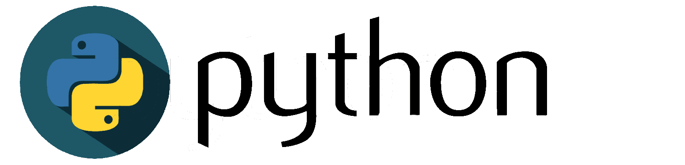

# Project Name

Descripción general de projecto generado.

## Table of Contents

- [About](#about)
- [Prerequisitos](#prerequisitos)
- [Preparación del entorno y ejecución](#usage)
- [Contributing](../CONTRIBUTING.md)

## 
## About <a name = "about"></a>
 
Espesificación del contenido y proposito del proyecto.


## 
## Prerequisites <a name = "prerequisitos"></a>

* [herramienta](https://pipenv-es.readthedocs.io/es/latest/) - _Herramienta de produccion que apunta a traer todo lo mejor de los mundos de empaquetado al mundo de Python. is Utiliza Pipfile, pip y virtualenv en un solo comando._

###
### install pipenv
```
$ pip install --user pipenv
```


## 
## Preparación del entorno y ejecución 🔧<a name = "usage"></a>

Instrucciones para ejecutar el proyecto

_Clonar el repositorio_

```bash
$ git clone https://github.com/Geronimo-montes/qry_generator
$ cd qry_generator
```

_Generar entorno virtual_

```bash
$ pip instal pipenv
$ pipenv install
$ pipenv shell
```

_Para correr el programa_

```bash
$ pipenv run dev
```


## Usage <a name = "usage"></a>

Add notes about how to use the system.
