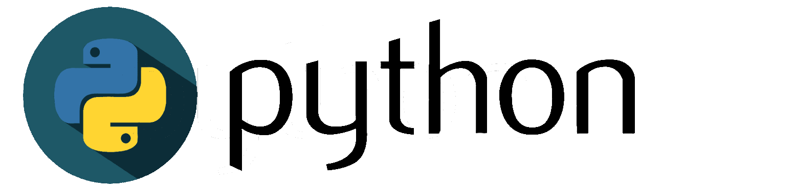

# Modulo: Nombre del modulo

Descripción general.

## Table of Contents

- [About](#about)
- [Clases, metodos, etc...](#docs)
- [Test](#test)

## 
## About <a name = "about"></a>
 
Espesificación del contenido y proposito del proyecto.


## 
## Prerequisites <a name = "prerequisitos"></a>

* [herramienta](https://pipenv-es.readthedocs.io/es/latest/) - _Herramienta de produccion que apunta a traer todo lo mejor de los mundos de empaquetado al mundo de Python. is Utiliza Pipfile, pip y virtualenv en un solo comando._

    ### Install pipenv
    ```
    $ pip install --user pipenv
    ```

## 
## Clases, metodos, etc...<a name = "docs"></a>
_Descripcion de las clases, metodos implementados._


## 
## Test <a name = "test"></a>
_Descripción de los test aplicados al modulo._